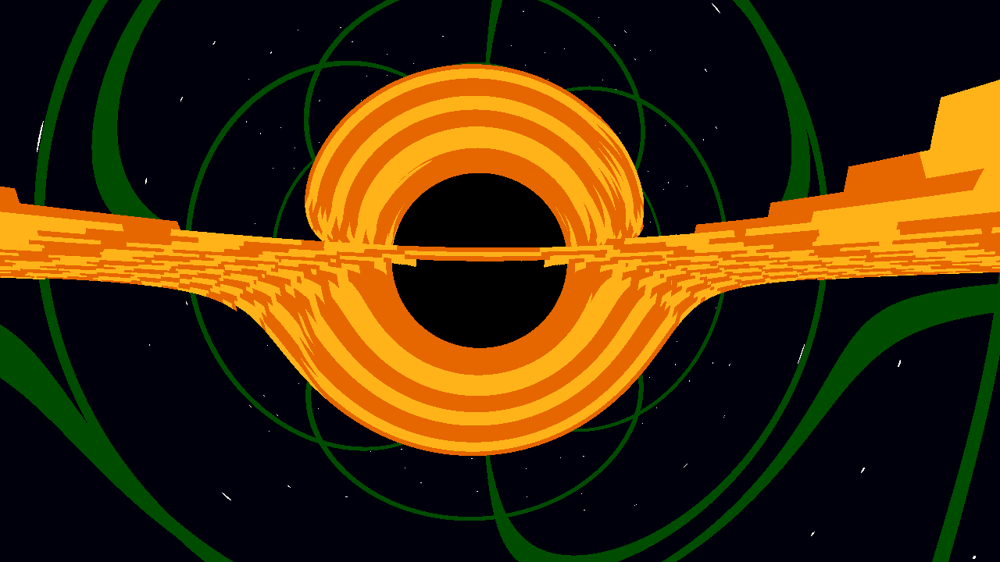

# Black Hole Ray Tracer (C++ / SDL2)



> **A real-time General Relativity engine that simulates the warping of spacetime around a Schwarzschild black hole.**

This project is an interactive physics simulation built from scratch without using pre-made game engines. It solves the **Geodesic Equations** of light rays in real-time using **Runge-Kutta 4 (RK4)** numerical integration, visualizing phenomena such as gravitational lensing, the Einstein Ring, and the event horizon shadow.

It was inspired by a very similar project done by kavan; which you can find on youtube as "Simulating Black Holes in C++". The main purpose of this project was just to explore some fun physics concepts while introducing myself to EMACS as well as terminal navigation.

Kavans program uses OPenGL and GLSL in order to run the simulation on the GPU, whereas mine is still ran through the CPU. It also provides for slightly less interaction and exploration of the bending of space we observe around blackholes. While mine still generates static gridlines that we can see twisting around the black hole it is rendered differently than Kavans simulation which allows us to pivot the camera around the central blackhole. His creates a 3D wireframe thats verticesd are bent and pushed around by gravity.

I also utlized Gemini-Pro for some of the SDL2 integration

---

##  Key Features

* **Real-Time Relativistic Physics:** Simulates the bending of light (Gravitational Lensing) by calculating the curvature of spacetime at every step of the ray's path.
* **Interactive Exploration:** Full 3D camera control allowing users to fly through the warped space and inspect the accretion disk from any angle.
* **High-Precision Math:** Implements a custom **RK4 Solver** (4th Order Runge-Kutta) rather than simple Euler integration to ensure stable orbits and accurate rendering near the Event Horizon.
* **Procedural Visualization:**
    * **Accretion Disk:** Volumetric rendering of the disk with relativistic frequency shifting (doppler beaming approximation).
    * **Celestial Grid:** A background "infinity sphere" grid that visually demonstrates the distortion of the coordinate system.
* **Photographer Mode:** One-press high-resolution rendering (1280x720) with accumulated sampling.

---

##  Controls

| Key | Action |
| :--- | :--- |
| **W / S** | Move Camera Forward / Backward |
| **A / D** | Strafe Left / Right |
| **Space** | Fly Up (Y-Axis) |
| **C** | Fly Down (Y-Axis) |
| **P** | **Take High-Res Screenshot** (Saves to `.ppm`) |
| **ESC** | Exit Simulation |

---

##  Installation & Build

This engine uses **SDL2** for window management and pixel plotting. It compiles natively on macOS and Linux.

### Prerequisites

**macOS (Homebrew):**
```bash
brew install sdl2
```
---

### Building the Project
1. Clone the Repository: 
```bash
   git clone
```
2. Comile: Includes MakeFile for automated building:
```bash
make
```
3. Run: 
```bash
./blackhole
```
---

### Math / Physics
1. Black Hole
Uses a blackhole as described by Schwarzschild Metric. Gravity simulated as curvature in path of light rays

2. Integration
Started with Euler to show the steps, progressed to Runge-Kutta 4 to allow for more accurate prepresnetaiton of the curvature. Ensure light rays dont clip event horizon

3.  Event Horizon
Black sphere in center is region where light can no longer escape; any ray that crosses threshold returns a pure black color

---

## Structure: 
* **main.cpp:** Core Engine. Handles SDL2 window as well as input procesing and ray loop
* **vec3.h:** Custom linear algebra library with overloaded operators in order to make operations simple
* **ray.h:** Defines ray class used in scene
* **Makefile:** build configuration script
